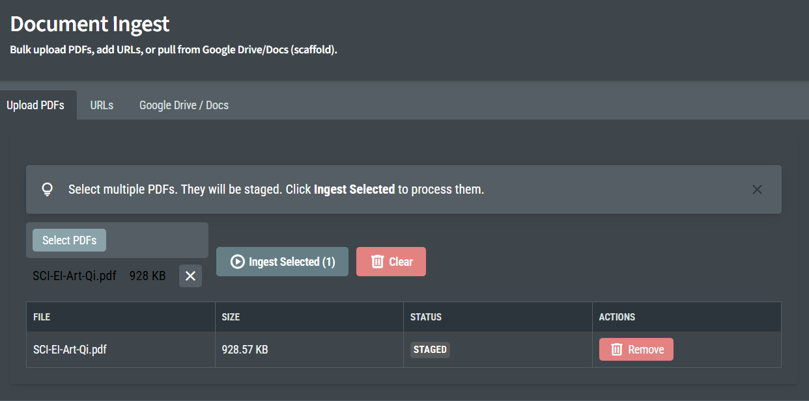

# LLM (OLLama + Gemma3-4 + SQLite RAG)
## With a Blazor UI.

Starting the Blazor app will simultaneously create the `Ollama` process, and will look for the `eloi_Modelfile` for building on top of `Gemma3-4`. The first time that happens might take a while. The subsequent startups will be quicker due to a hashing mechanism.

Ingests documents into a **SQLite-backed RAG** store and queries them with `Ollama` + `Gemma3-4` + your own customized `eloi_Modelfile`. 
Customize the `eloi_Modelfile` to your liking.

Upload **multiple PDFs at once**, add **URLs**, and (optionally) pull from **Google Drive / Google Docs** (scaffold/integration-ready). 
Built with the Radzen & Blazor combo has been great for UI/UX.
---

This project turns “a pile of PDFs (and links)” into a searchable, chunked knowledge base:

1. **Chat**: pulls context from the information you've taught her before responding.
1. **Ingest**: PDFs / URLs / Google Docs → extract text → chunk → embed → store in SQLite  
2. **Retrieve**: semantic search over embeddings + metadata filters  
3. **Generate**: send the retrieved context to an Ollama model for grounded answers

---

## Features

- **Bulk PDF upload** (multi-select) with staging + “Ingest Selected”
- **PDF text extraction** via **UglyToad.PdfPig**
- **Local-first RAG**:
  - Chunking + embeddings
  - **SQLite** persistence (documents, chunks, vectors, metadata)
  - Fast retrieval for small/medium collections
- **Ollama** integration for:
  - Embeddings model (e.g., `nomic-embed-text`)
  - Chat/completions model (e.g., `llama3`, `qwen2.5`, etc.)
- **Radzen Blazor Server UI**:
  - Tabs for **Upload PDFs**, **URLs**, **Google Drive / Docs**
  - Data grid with status + actions (remove/clear)
- **SignalR** progress updates:
  - Real-time ingest status (“staged”, “processing”, “done”, “failed”)
- **Google Drive / Docs integration** (scaffold):
  - Wiring points included to fetch file content and ingest it like PDFs/URLs

---

## Tech Stack

- **Ollama** (local LLM + embeddings)
- **SQLite** (local persistence)
- **UglyToad.PdfPig** (PDF extraction)
- **Radzen Blazor Components**
- **Blazor Server**
- **.NET / C#**
- **SignalR**

---

## Architecture (high level)

**UI (Radzen Blazor)**  
→ calls an ingest endpoint/service  
→ publishes progress via **SignalR Hub**  
→ writes to **SQLite**

**Ingest Pipeline**
- Source: PDF / URL / Google Doc  
- Normalize text
- Chunk (token/character window + overlap)
- Embed (Ollama embeddings)
- Persist: Document + Chunks + Embeddings + Metadata

**Query Pipeline**
- User prompt
- Embed query (Ollama embeddings)
- Vector search (SQLite)
- Compose context (top-k chunks)
- Generate answer (Ollama chat)

---

## Getting Started

### Prerequisites
- **.NET SDK** (matching the project’s target framework)
- **Ollama** installed and running locally  
  - Your ollama installation will run side-by-side (e.g.: `http://localhost:11434`)
  - Install: https://ollama.com  
  - Start the service: `ollama serve`
  - Select `gemma3-4` from the list of models available.
  - Then you no longer have to use the official Ollama app.
    - You can open the Blazor app and the process will run in the background with the customized Gemma model.
  - Chat model example: `ollama pull llama3`
  - Embeddings model example: `ollama pull nomic-embed-text`
